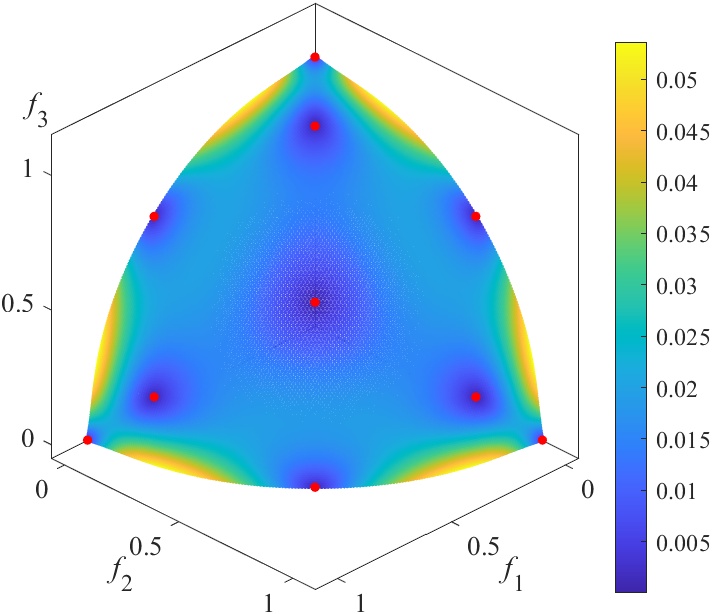

# Doctoral Thesis Image
{: align="center"}
  
1: 応答曲面法の例

|||
|:-:|:-:|
|||
|2a. 目的ベクトルf1,f2,...,f5|2b. 入力e1,e2,...,e5と出力n1,n2,...,n5|
|||
|2c. 推定したノルム|2d. 推定したパレートフロント|

||||
|:-:|:-:|:-:|
||||
|3a. DTLZ1 (N = 5)|3b. Convex DTLZ2 (N = 5)|3c. Convex DTLZ2 (N = 20)|
||||
|3d. DTLZ2 (N = 5)|3e. I-DTLZ2 (N = 5)|3f. I-DTLZ2 (N = 20)|
||||
|4a. DTLZ7 (N = 9)|4b. Convex DTLZ2 (N = 5)|4c. Convex DTLZ2 (N = 20)|
|||3|
|5a. f1 : f2 = 1 : 1|5b. f1 : f2 = 3 : 1|5c. f1 : f2 = 1 : |
||||
|6a. Simpex-lattice|6b. Incremental lattice|6c. Hammersley method|
||||
|7a. Simpex-lattice|7b. Incremental lattice|7c. Hammersley method|
||||
|8a. Simpex-lattice|8b. Incremental lattice|8c. Hammersley method|
||||
|9a. DTLZ1|9b. DTLZ2|9c. Convex DTLZ2|
||||
|10a. DTLZ7|10b. C3-DTLZ1|10c. C3-DTLZ4|

# EMO2021 Image
||||
|:-:|:-:|:-:|
||||
|1a. Input|1b. Estimation model|1c. Output|
||||
|2a. DTLZ1 (N = 5)|2b. Convex DTLZ2 (N = 5)|2c. Convex DTLZ2 (N = 20)|
||||
|2d. DTLZ2 (N = 5)|2e. I-DTLZ2 (N = 5)|2f. I-DTLZ2 (N = 20)|
||||
|3a. DTLZ7 (N = 9)|3b. Convex DTLZ2 (N = 5)|3c. Convex DTLZ2 (N = 20)|
||||
|4a. f1 : f2 = 1 : 1|4b. f1 : f2 = 3 : 1|4c. f1 : f2 = 1 : 3|
||||
|5a. Simpex-lattice|5b. Incremental lattice||
||||
|6a. Simpex-lattice|6b. Incremental lattice|6c. Hammersley method|
||||
|7a. Simpex-lattice|7b. Incremental lattice|7c. Hammersley method|
||||
|8a. DTLZ1|8b. DTLZ2|8c. Convex DTLZ2|
||||
|9a. DTLZ7|9b. C3-DTLZ1|9c. C3-DTLZ4|